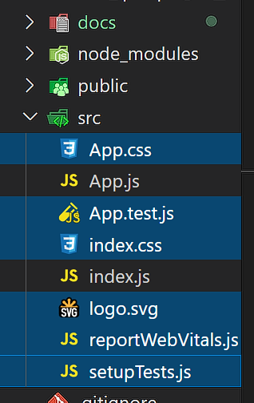

# Description
Admin / Central Dashboard made in react

# Getting Started
1. In the terminal run
<br>
<code>npx create-react-app ./</code>

2. Install the Material Icons
<br><code>yarn add @material-ui/icons</code>
<br><code>yarn add @material-ui/core</code>

3. Install recharts
<br><code>yarn add recharts</code>

4. Clean application directories by removing the files we don't need from the public directory
<br>

5. Clean the file from the src directory that we dont need
<br>

6. Clean the index.html file of some code 
<br>

7. Install the fonts from google fonts and copy them in index.html

8. In index.js delete the imports for the file that we're deleted before

9. Your App.js file should look like this 
<br>

# Creating the components

<strong>1. TopBar</strong>
<br>a. Create Topbar.jsx - we are using JSX because it's more easier to use html inside of the components.
<br>
b. Topbar.jsx - Type in rfc - this is a special command for React, which can be installed from the VS Extension tab. It's called ES7 React/Redux
<br>
Your code should look like:
```
import React from 'react'

export default function Topbar() {
  return (
    <div>Topbar</div>
  )
}
```
c. App.js -  Import the Topbar component in App.js
```
import Topbar from './components/topbar/Topbar'
function App() {
  return (
    <div>
      <Topbar/>
    </div>
  )
}
export default App;
```

d. topbar.css - inside the topbar folder create a new file topbar.css
<br>
e. Topbar.jsx - import the topbar.css file created
<br><code>import './topbar.css'</code>


# Features
<br> 1. Reports with webdata-rocks
<br> Install yarn add webdata-rocks
<br> Create Report.jsx and add code : 
```
import React from 'react'
import * as WebDataRocksReact from 'react-webdatarocks';
import "./reports.css"
import 'webdatarocks/webdatarocks.css'

export default function Reports() {
  return (
    <div className="reports">
      <div className="App">
        <WebDataRocksReact.Pivot 
         toolbar={true}
         componentFolder="https://cdn.webdatarocks.com/"
         width="100%"
         report="https://cdn.webdatarocks.com/reports/report.json"
        />
      </div>
      
      </div>
  )
}
```


# Errors
1. Unreachable code  no-unreachable in App.js and the Topbar.jsx component is not loading in the App.js screen
<br>Possible you forgot to add the parenthesis's to the return ()
<br>

2. react-router-dom
<br>Please install the react-router-dom@5.2.0 instead of the latest version of react-router-dom

3. yarn add @mui-material
<br>You might have an error regarding the material ui icons, 
<br>Install the @mui-material package as well because the latest version was renamed to mui from material

3. Can't resolve '@mui/data-grid'
<br> Import as 
<br><code>import { DataGrid } from "@mui/x-data-grid";</code>

4. The users page is not showing up
<br> In the userList.jsx import the DataGrid from material-ui 
<br><code>import { DataGrid } from "@material-ui/data-grid";</code>

